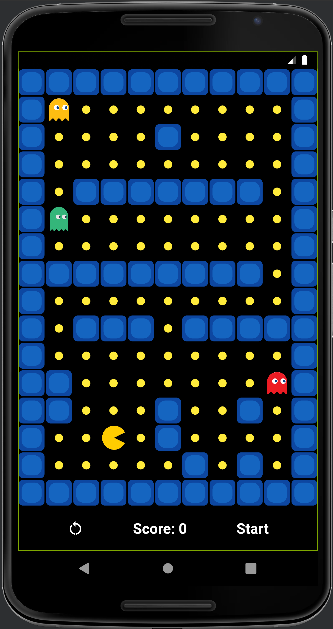
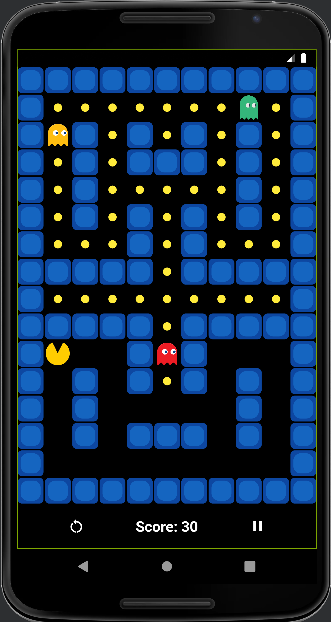
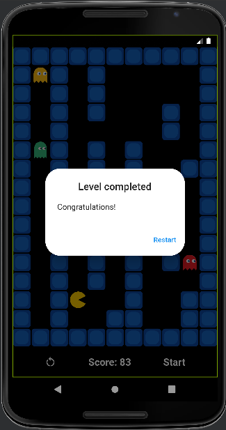
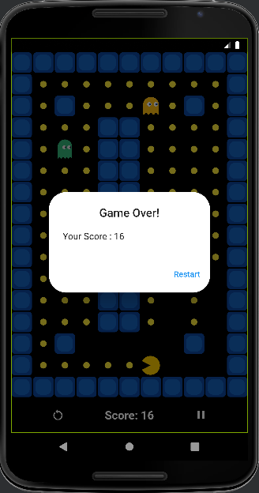

# pacman_getx

## About

The beloved vintage Pacman game with Flutter Animations compatible in both Android and IOS.  
The player controls Pac-Man, who must eat all the dots inside an enclosed maze while avoiding three colored ghosts.

## Game instructions

1. Press Start button
2. Use gestures for moving.
    * Swipe left to move left.
    * Swipe right to move right.
    * Swipe up to move up.
    * Swipe down to move down.
3. Stay away from ghosts.
4. Eat all the food.

## State Management
[GetX](https://pub.dev/packages/get) is a quick, stable, and light state management library in flutter.

## Screenshots

| Initial mode                                                        | Playing mode                                                       | Winning mode                                                       | Losing mode                                                       |
|---------------------------------------------------------------------|--------------------------------------------------------------------|--------------------------------------------------------------------|-------------------------------------------------------------------|
|  |  |  |  |

